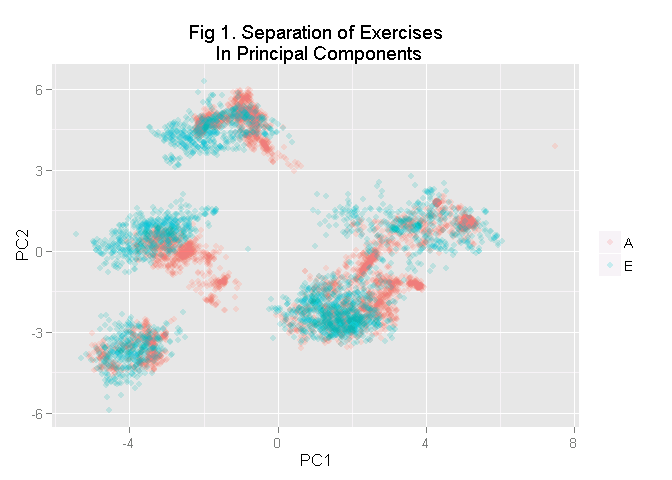
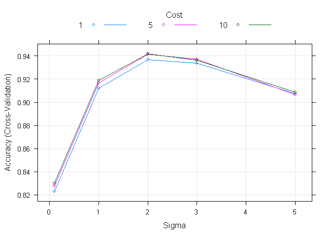

# Activity Classification
Sergey Polgul  
Saturday, September 20, 2014  

##Synopsis

We demonstrate that it is possible to build an accurate machine learning 
algorithm for grading quality of the exercises. We achieve over 94% accuracy in
grading of the quality of exercise compared to human grading.


##Data Description
Six young health participants were asked to perform one set of 10 repetitions of the Unilateral Dumbbell Biceps Curl in five different fashions: exactly according to the specification (Class A), throwing the elbows to the front (Class B), lifting the dumbbell only halfway (Class C), lowering the dumbbell only halfway (Class D) and throwing the hips to the front (Class E).[1]

Original data set consited of 19622 observarions of 159 features and human
assigned label. We have split these data into training set with 14718 observations
and validataion set with 4904 obesrvations.

## Methods 

Below we are loading both data files ( training an testing). Testing files is 
not labeled and not available for us. We will split training data in two subsets
one we will call training and will use for model building and another one we will
call cross validation since term "testing" is used for assignment grading data
set.

We are not using cross validation test set for model building. We are only using 
it one time to get an estimate of the performance for the final model.

### Data Pre-Processing
Below we are only loading features that we are using for model building selected
during exploratory analysis. This sub sample contains only data that has a lot of 
variation and are not null or blank. We have omitted features that are mostly 
blank or have no variation in the data.


```r
library(data.table)
library(caret)

training = fread("H:/datasets/pml-training.csv",na.strings=c("NA","#DIV/0!",""))

set.seed(1713)
inTrain<- createDataPartition(y = training$classe, 
  						#outcome data
							p = .75,
							list = FALSE)

Train <- training[as.vector(inTrain)]
CV    <- training[-as.vector(inTrain),]

fieldTypes<-rep("numeric", 160)
fieldTypes[c(2, 5, 6)] = 'character'

testing =  fread("H:/datasets/pml-testing.csv", na.strings=c("NA","#DIV/0!",""))

#load list of features we will be using for this prediction
load("usefulFeatures.rdf")
#load uF useful Features

uTest <- testing[,c(names(uF)), with=FALSE] # data.table syntax
uCV   <- CV[,c(names(uF)), with=FALSE]
uTrain <- Train[,c(names(uF)), with=FALSE]


#convert all to numeric,
uTrain <- uTrain[, lapply(.SD, as.numeric)]
sum(complete.cases(uTrain))
```

```
## [1] 14718
```

```r
uCV <- uCV[, lapply(.SD, as.numeric)]
uTest <- uTest[, lapply(.SD, as.numeric)]

#rm(list=c('uF', 'usefulFeatures', 'inTrain', 'fieldTypes')
```

### Feature Engeneering

At this point we have 52 features we could use for model building. 
We intend to use a support vector machine for classification of the activity
as it shows good results for these data. We will center, scale and preprocess
data with PCA and will set to retain 90% of variability in the data but will 
receive a reduced set of features.


```r
require(caret)
#a map of transofrmations
# train -> useful Train -> scaled Train
### converting to data frame for predictions/modeling caret has a problem with 
### data.table
#convert to normal data.frame all data sets
uTrain = data.frame(uTrain)
uCV   = data.frame(uCV)
uTest =  data.frame(uTest)

pcaPreProc <- preProcess(uTrain, method="pca", thresh=.9)

sTrain <- predict(pcaPreProc, uTrain)
sCV    <- predict(pcaPreProc, uCV)
sTest  <- predict(pcaPreProc, uTest)

#sTrain$classe = train$classe

#factorized outcome variable
fctClasse <- as.factor(Train$classe)
```


We have reduced data to 18 features or principal components and still retain 90%
of variability.
Here we are taking a look at our data to see if we can get good separation 
in Principal components space between different activities.


```r
svdTrain = svd(scale(uTrain))
names(uTrain)[order(abs(svdTrain$v[,1]),decreasing=T)[1:4]]
```

```
## [1] "accel_belt_z"     "accel_belt_y"     "roll_belt"       
## [4] "total_accel_belt"
```

```r
names(uTrain)[order(abs(svdTrain$v[,2]),decreasing=T)[1:4]]
```

```
## [1] "accel_belt_x"  "pitch_belt"    "magnet_belt_x" "yaw_dumbbell"
```

```r
names(uTrain)[order(abs(svdTrain$v[,3]),decreasing=T)[1:4]]
```

```
## [1] "magnet_arm_y" "magnet_arm_z" "accel_arm_z"  "magnet_arm_x"
```

```r
names(uTrain)[order(abs(svdTrain$v[,4]),decreasing=T)[1:4]]
```

```
## [1] "gyros_forearm_z"  "gyros_dumbbell_z" "gyros_dumbbell_x"
## [4] "gyros_forearm_y"
```

We will look into first Principal components and will see what features are top
contributors to them:

- First one is mostly related to belt measurements in y and z dimensions
- Second One is related to belt measurements belt dimension in x coordinate
- Third one is mostly related to arm measurements
- Forth one is mostly related to forearm and dumbbell measurements 
Interpretation of PCA on a more detailed level gets much harder.

Below we display how two types of exercises are separated in firs two principal
components.


```r
library(ggplot2) 
iAE = fctClasse %in% c("A", "E")

pcplot <- ggplot(data=sTrain[iAE,], aes(x=PC1, y=PC2, color=fctClasse[iAE])) + 
  	geom_point(alpha=0.2)  + 
scale_color_discrete(name="", breaks=levels(fctClasse)) +
ggtitle("Fig 1. Separation of Exercises\n In Principal Components")

plot(pcplot)
```

 

### Model Fitting
Our methodology for building the model is to build it on testing data set and use
different bootstraps of the data for model building and parameter tuning.
Model performance and selection is done on out of sample bootstraps.

Final model performance is estimated on the cross-validation sample that was not
used in model building at all.


We will further proceed with building a predictive model based on support vector
machine with radial kernel function.[3]

We are choosing model parameters over the grid of cost and sigma parameters of the
radial basis function. 


```r
if (!file.exists("mod/csvm5.save")) {
require(caret)
require(doParallel)

ctrl <- trainControl(method = "cv", savePred=T, classProb=T)

cl <- makeCluster(detectCores())
registerDoParallel(cl)

tg5 <- expand.grid( sigma = c(.1, 1, 2,3,5), C = c(1,5,10))
t5 <- system.time(
        csvm5 <- train( fctClasse~. , data=sTrain,
                        method = "svmRadial",
                        #tunelength = 9,
                        tuneGrid = tg5,
                        #preProc=c("center", "scale"),
                        #metric = "ROC",
                        trControl = ctrl
                )
  )
save(csvm5, file="mod/csvm5.save")
} else {
  load("mod/csvm5.save")
}
```


#### Model Tuning Visualisation
Below is the chart that displays out of sample cross validation error for each 
set of parameters used during model building.

Our final model has parameter sigma=2 and Cost=10.

##### Fig.2 SVM Tuning Accuracy
Tuning accuracy calculated on the out of sample set during cross-validation phase
of model building.

 

### Model Performance
Below we measure prediction accuracy metrics on held-out cross-validation set
that we did not use for exploratory analysis or model building. Our Measure of
accuracy is in line with the measure of accuracy statistically estimated during
model building.

#### Table 1. Expected Measures of Performance 

```r
require(caret)
confusionMatrix(CV$classe, predict(csvm5, newdata=sCV))
```

```
## Confusion Matrix and Statistics
## 
##           Reference
## Prediction    A    B    C    D    E
##          A 1380    2    0    0   13
##          B    5  918    9    0   17
##          C   25   17  752   54    7
##          D   21    1   31  699   52
##          E    0    0    3    2  896
## 
## Overall Statistics
##                                         
##                Accuracy : 0.947         
##                  95% CI : (0.941, 0.953)
##     No Information Rate : 0.292         
##     P-Value [Acc > NIR] : <2e-16        
##                                         
##                   Kappa : 0.933         
##  Mcnemar's Test P-Value : <2e-16        
## 
## Statistics by Class:
## 
##                      Class: A Class: B Class: C Class: D Class: E
## Sensitivity             0.964    0.979    0.946    0.926    0.910
## Specificity             0.996    0.992    0.975    0.975    0.999
## Pos Pred Value          0.989    0.967    0.880    0.869    0.994
## Neg Pred Value          0.985    0.995    0.989    0.986    0.978
## Prevalence              0.292    0.191    0.162    0.154    0.201
## Detection Rate          0.281    0.187    0.153    0.143    0.183
## Detection Prevalence    0.284    0.194    0.174    0.164    0.184
## Balanced Accuracy       0.980    0.985    0.960    0.950    0.954
```
## Results
We have demonstrated that is possible to build an accurate classifier that 
will grade quality of the exercise.

### References
[1] Velloso, E.; Bulling, A.; Gellersen, H.; Ugulino, W.; Fuks, H. Qualitative Activity Recognition of Weight Lifting Exercises. Proceedings of 4th International Conference in Cooperation with SIGCHI (Augmented Human '13) . Stuttgart, Germany: ACM SIGCHI, 2013.

   http://groupware.les.inf.puc-rio.br/har#ixzz3DPrYDOIw
   
[2] Support Vector Machines in R. Journal of statistical Software. Accessed 09/05/2014.
    http://www.jstatsoft.org/v15/i09/paper
    
[3] Kuhn, M. 2008. Building Predictive Models in R Using the caret Package. 
    Journal of Statistical Software, Volume 28, Issue 5, p. 1.
    

