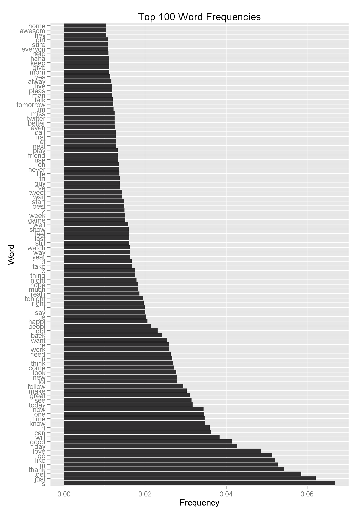
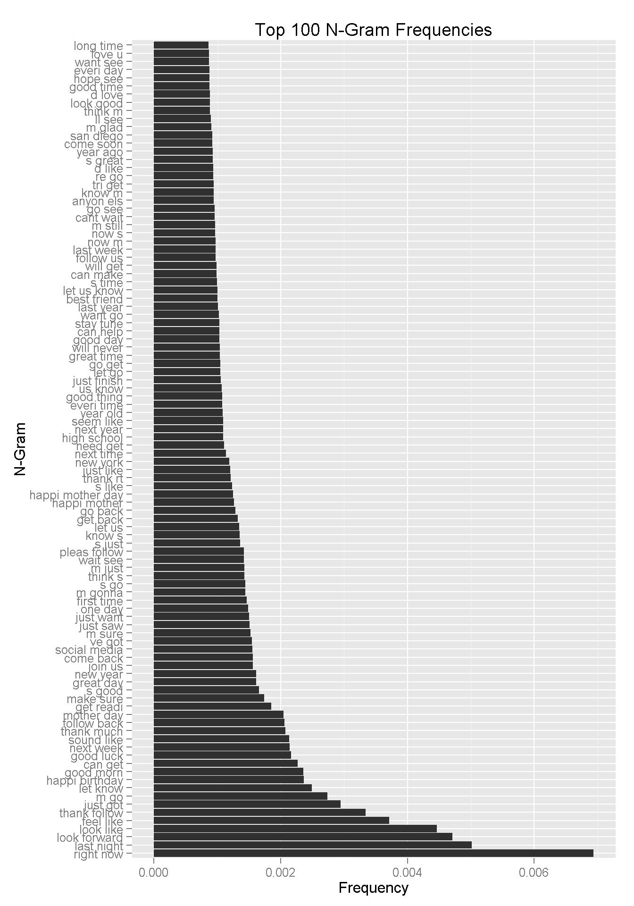

The purpose of this document is to conduct exploratory data analysis for the 
SfitKey assignment.
We will proceed with loading the data. 


```{r "conf", echo=F, cache=T}

datadir <- '../../Uploads'
files = Sys.glob(paste0(datadir,'/en_US*.txt*'))

Sys.setenv(JAVA_HOME='C:\\apps\\jre8u40x64')
Sys.setenv(WNHOME='../../Uploads/')
#options( java.parameters = "-Xmx1g" )
#Sun gave us the -Xmx flag to increase the heap size (and -Xms to increase the stack size).


require('stringi')
library(data.table)
library(StanfordCoreNLP)


# sdir = '../../Uploads'
# 
# 
# twitter.all <- readLines(paste0(sdir, 'en_US.twitter.txt'), encoding="UTF-8")
# Encoding(twitter.all) <- "UTF-8" 
# twitter.all <-iconv(twitter.all, "UTF-8", "ASCII",sub='')
# n.twitter = length(twitter.all)
# set.seed(1744)
# train = sample(1:n.twitter, size = floor(.6 * n.twitter))
# expl  = sample(train, size=5e5)
# 
# twitter.expl = twitter.all[expl]
```

```{r readData, cache=T}

### blogs 6secs - 250Mb
system.time(
  blogs <- stri_read_lines(files[1])
)

### try reading file news 7 secs 277MB
system.time(
  news <- stri_read_lines(files[2])
)

## 7 sec


### tweets this breaks on Nul character in string
# system.time(
#   tweets <- stri_read_lines(files[3], locale = NA)
# )


#20 secs, 300M
# system.time({
#   file.tweets = file( files[3]);
#   tweets <- readLines(file.tweets, encoding='UTF-8', skipNul = T )
# })
# close(file.tweets)

#18.97 secs 301M
system.time({
  file.tweets = gzfile(files[3]);
  tweets <- readLines(file.tweets, encoding='UTF-8', skipNul = T )
})
close(file.tweets)


system.time ({ 
  news <- stri_enc_toascii(news)
  blogs <- stri_enc_toascii(blogs)
  tweets <- stri_enc_toascii(tweets)
})

#tweets[164146]

#Remove all non-letters
##blogs<- stri_replace_all_regex(blogs,"[^\\p{L}\\s]+","")

news <- stri_replace_all_regex(news,"\\032+","'")
tweets <- stri_replace_all_regex(tweets,"\\032+","'")
blogs <- stri_replace_all_regex(blogs,"\\032+","'")


```

Data consists of news, blogs and twitter data set prepared by Heliohost(http://www.corpora.heliohost.org/)
Tweets data set contains `r length(tweets)` messages.

News data set contains `r length(news)` messages.

Blogs data set contains `r length(blogs)` messages.


```{r wordCounts, cache=T}
tw=stri_extract_all_words(stri_trans_tolower(tweets))
tw_count=sum(sapply(tw, length))

nw=stri_extract_all_words(stri_trans_tolower(news))
nw_count=sum(sapply(nw, length))

bw=stri_extract_all_words(stri_trans_tolower(blogs))
bw_count=sum(sapply(bw, length))

rm(tw, nw, bw)
gc()
```


Twitter data set contains `r tw_count` words.

News data set contains `r nw_count` words and blogs data set contains `r bw_count` words totaling just a bit
over 100 million words and sequences we can use in our predictive model.

Our approach for implementing a predictive model is to base prediction of the next
on few preceding words that were typed in by the user. Paricularily due to memory limitations
we will limit English dictionary to 16000 words, and will limit size of one-, two-, tri- and four- grams
to meet our memeory requirements.

Building n-grams will be the most time and memory-consuming part of our process.
However these tasks do not need to be carried out on the mobile device. 


Following building the corpus we examine most frequently used words.
It is obvious that for us to be able to predict the next word it should be
frequent in the corpus.


Lets plot frequencies of occurrences of words

```{r fig.heght=10, fig.width=8}

```


A Plot of Top 100 N-Grams
```{r fig.heght=10, fig.width=8}

```
